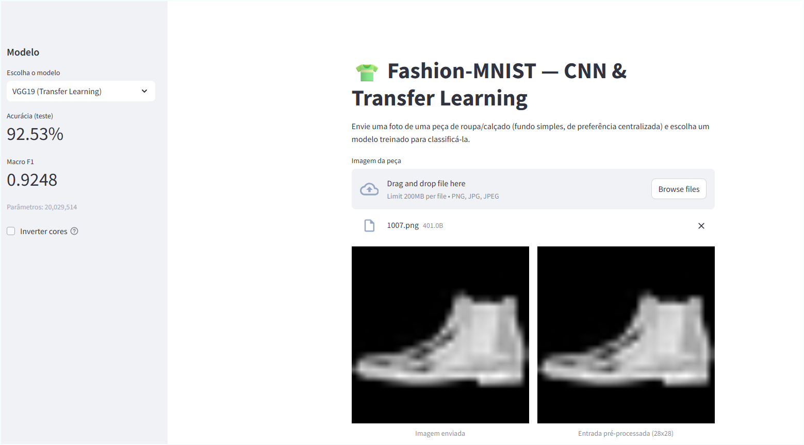
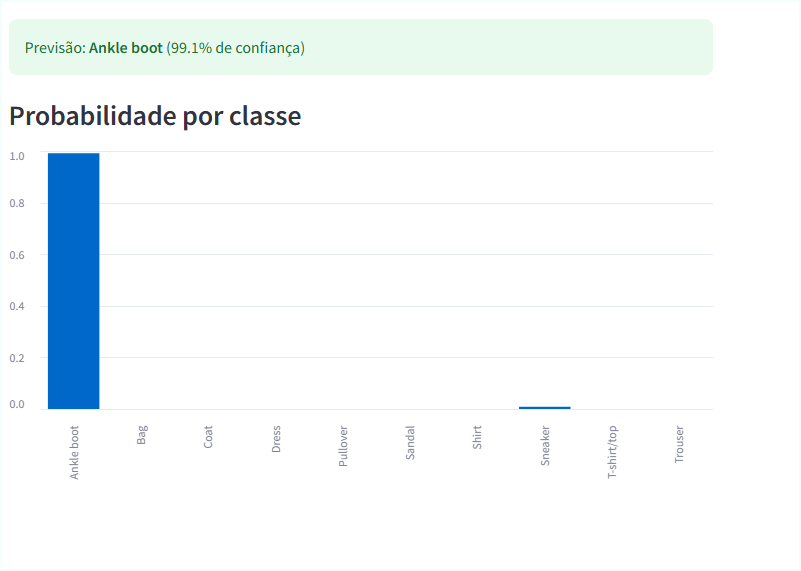
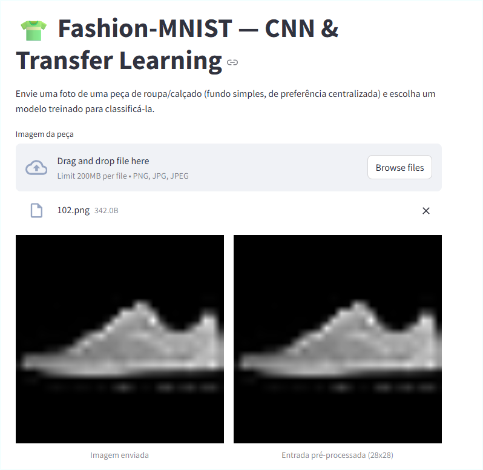
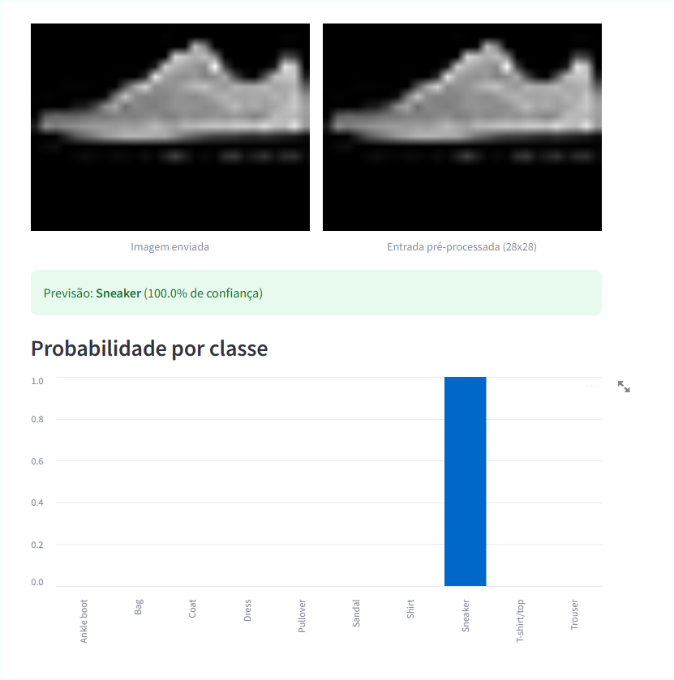

# 👕 Fashion-MNIST — CNN & Transfer Learning

[](https://www.python.org/)
[](https://www.tensorflow.org/)
[](https://keras.io/)
[](https://streamlit.io/)
[](https://mlflow.org/)
[](https://airflow.apache.org/)
[](https://www.docker.com/)
[](LICENSE)
[](https://github.com/RafaelGallo/Convolutional-Neural-Network-Transfer-Learning/commits/main)


Image classification on **Fashion-MNIST** with a CNN built from scratch and five **Transfer Learning** backbones (MobileNetV2, VGG16, VGG19, ResNet50, EfficientNetB0), served through a **Streamlit** app, with experiment tracking in **MLflow** orchestrated by **Airflow**, all running via **Docker Compose**.

📄 Full documentation: [doc/README.md](doc/README.md) · [doc/README.pdf](doc/README.pdf)

---

## Results

| Model | Test accuracy | Macro F1 | Macro AUC | Params | Training time |
|---|---|---|---|---|---|
| **CNN baseline** | **94.21%** | **0.9419** | **0.9974** | 288,618 | — |
| VGG19 | 92.38% | 0.9233 | 0.9955 | 20,029,514 | 1,190.87 s |
| VGG16 | 92.26% | 0.9220 | 0.9953 | 14,719,818 | 956.50 s |
| ResNet50 | 92.05% | 0.9199 | 0.9953 | 23,608,202 | 492.24 s |
| MobileNetV2 | 91.65% | 0.9163 | 0.9951 | 2,270,794 | 185.15 s |
| EfficientNetB0 | 90.80% | 0.9078 | 0.9942 | 4,062,381 | 235.32 s |

The from-scratch CNN baseline, despite being far smaller, beats every transfer learning backbone on accuracy, F1 and AUC — expected, since those backbones were pretrained on natural ImageNet images and here have to handle small, grayscale, artificially upscaled inputs. The macro AUC ≥ 0.994 across all models shows that even the lower-accuracy ones rank classes well — errors concentrate on a few visually similar classes rather than random confusion.

## App in action

Streamlit app classifying images in real time (`http://localhost:8501`):

<table>
<tr>
<td width="50%">

**Ankle boot** — VGG19, 99.1% confidence




</td>
<td width="50%">

**Sneaker** — 100% confidence




</td>
</tr>
</table>

## Stack

| Layer | Technology |
|---|---|
| Modeling | TensorFlow / Keras 3 (custom CNN + `keras.applications`) |
| Experiment tracking | MLflow (metrics, training curves, `.keras` artifacts) |
| Orchestration | Apache Airflow (DAG triggers the metrics import into MLflow) |
| Serving / inference | Streamlit |
| Infrastructure | Docker + Docker Compose |
| Dataset | [Fashion-MNIST](https://www.kaggle.com/datasets/zalando-research/fashionmnist) (Kaggle) |

## Quick start

```bash
git clone https://github.com/RafaelGallo/Convolutional-Neural-Network-Transfer-Learning.git
cd Convolutional-Neural-Network-Transfer-Learning

# starts the Streamlit app + MLflow + Airflow
docker compose up -d --build
```

- Streamlit app: http://localhost:8501
- MLflow UI: http://localhost:5000
- Airflow UI: http://localhost:8081

Or, without Docker:

```bash
pip install -r requirements.txt
streamlit run app/app.py
```

Full details (project structure, training pipeline, troubleshooting) in **[doc/README.md](doc/README.md)**.

## Project structure

```
├── airflow/dags/        # DAG that imports models/metrics into MLflow
├── app/app.py           # Streamlit inference app
├── doc/                 # Full documentation (README.md and README.pdf)
├── docker/              # Dockerfiles for the app and MLflow
├── docker-compose.yml   # Orchestrates streamlit + mlflow + airflow
├── models/              # Trained models (.keras) and metrics (.json)
├── notebook/            # Training notebook (EDA, CNN, transfer learning, evaluation)
├── scripts/             # Script that imports metrics into MLflow
└── src/                 # Dataset download (Kaggle) and load into SQLite
```

## License

[MIT](LICENSE) © Rafael Gallo
